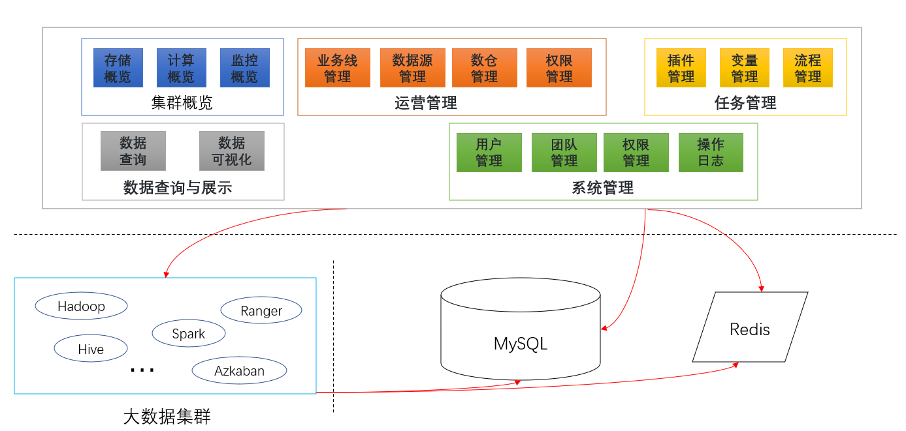

# cocoa
可可西里是一个面向运营、数据开发与数据分析同学的开源大数据平台项目，旨在降低数据开发与数据应用的门槛。

## 概览
Cocoa目前规划集群概览、运营管理、任务管理、数据查询、数据可视化、系统管理六大模块。

## 快速开始

[详见文档](./docs/quick_start.md)

## 功能图解

如上图所示：

​	集群概览模块：Cocoa平台通过定时调度任务(默认为一分钟) 轮询大数据平台接口，获取数据后插入Mysql供前端展示

​	任务管理模块：Cocoa平台根据用户插件的编排生成Workflow流所需要资源，然后提交到Azkaban。然后通过Cocoa界面对任务进行调度和监控

​	系统管理模块：Cocoa平台层面对权限进行用户团队级别管控，然后通过团队映射Ranger上的用户，然后通过Ranger用户使用真实的系统用户进行权限管控

//TODO

## 集群概览

在集群概览中，主要通过定时调度任务轮询jmx接口，将集群存储资源、计算资源指标数据写入数据库，并在前端页面进行展示【TODO:实时报警监控】
### 存储资源
  展示指标主要有：总存储容量、已用存储容量、总文件数、Block数、活跃节点、死亡节点、丢失Block数、坏盘数
### 计算资源
  展示指标主要有：正在运行的任务、挂起的任务、总任务、失败任务、Kill任务、可用内存、可用内核等

## 运营管理
运营管理模块主要包含业务线的管理、数据源的管理、数据同步、权限管理

业务线对应着一个资源队列和配额，通过业务线的概念将数据源、数据存储、数据计算进行逻辑或物理隔离，从而实现对大数据宏观层面对治理。
## 任务管理
在Cocoa中，将任务绑定到业务线上，也就是说一个业务线有可能对应着多个任务，而一个任务（可以理解为一个workflow）有对应着多个插件（可以理解为单一job，如：spark清洗数据job/Java数据校验job）。插件可以独立运行，也可以多个相互依赖进行构建workflow。

插件分为通用插件（如：数据同步插件）和私有插件（如：营销业务线的回流客户计算插件）之分。

对于任务又构建了任务变量，其主要目的是对绑定任务进行一些指标统计，如：该任务总共读取多少条数据

## 数据查询
  此模块通过对计算引擎（hive/spark/persto）进行即时查询

## 数据可视化
  此模块主要用来对指标进行数据可视化
## 系统管理
  对于Cocoa平台，用户体系主要通过平台用户、平台团队和系统用户实现。简单可以理解为：一个用户对应着一个团队，而默认一个团队默认对应着一个Linux系统对用户，也就是租户。对于此模块底层通过Ranger进行实现。
